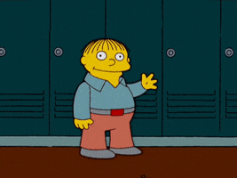
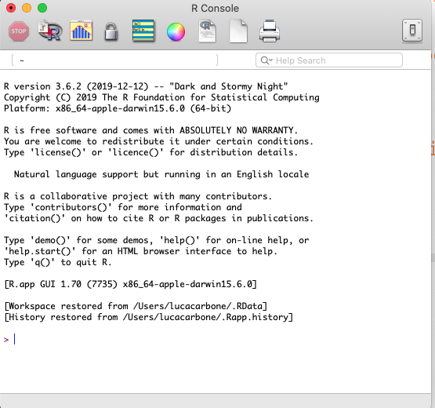
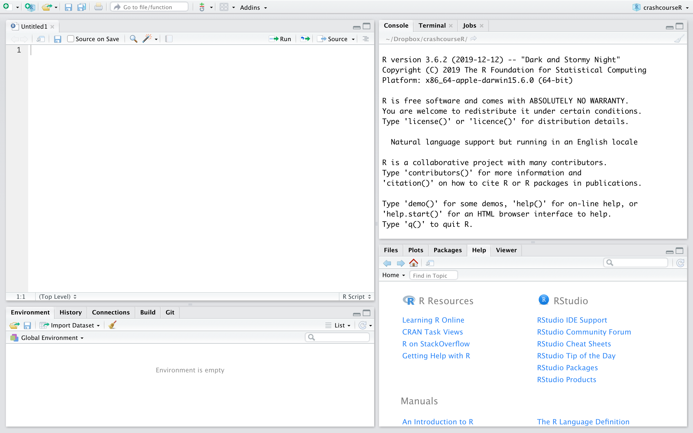

 

# Welcome to the R Crash Course!

{ width=1000% height=1000%}

R is an open source programming language, extremely versatile and increasingly used in academia and industry for data analysis. Together with RMarkdown, RStudio can be employed to build personal [websites](https://www.amyorben.com) or pages (like this one!).

 

R is good for several reasons:

| • It's open source (you can always check what happens under the hood);
| • New methods are continuously implemented;
| • Great R community (developers and users) online, where to always find (or ask for) help. For example, [StackOverFlow](https://stackoverflow.com);
| • Optimal for open science: clear syntax that makes easy to replicate results;
| • It's free.

 

# Overview

In these weeks, we will cover the following topics:

| First week ()
|   1. Install [R](https://www.freestatistics.org/cran/) and [RStudio](https://rstudio.com/products/rstudio/download/);
|   2. Install/load packages;
|   3. Simple calculations;
|   4. Basic objects: vector, matrix, data frame, list, data types;
|   5. Descriptives: importing/exporting data, summarising;
|   6. Operations with objects and indexing.

 

| Second week ()
|    1. Wrangling - tidyverse;
|    2. Loops, conditionals (if else, ifelse, while), function, apply family.

 

| Third week ()
|    1. Loading/saving data (heaven/foreign package);
|    2. GLM.

 

| Fourth week:
|    1. SEM and structural plotting;
|    2. Missing data.

 

| Fifth week:
|    1. Basic plotting;
|    2. ggplot.

 

| Sixth week:
|    1. RMarkdown: citation, write a paper in R, embed analyses, open science (power analysis, use.seed());
|    2. Additional questions.

 

# Install R and RStudio

> Additional info can be found on the [RStudio IDE Cheat Sheet](https://rstudio.com/wp-content/uploads/2016/01/rstudio-IDE-cheatsheet.pdf)

 

This is R

This is RStudio

