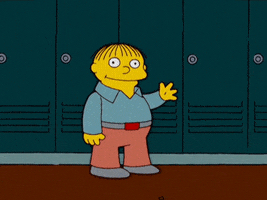

## Welcome to the R Crash Course! PROVA

<center>

{width=70% height=70%}

</center>

## 1 What is R

R is an open source programming language, extremely versatile and increasingly used in academia and industry for data analysis. Together with RMarkdown, RStudio can be employed to build personal [websites](https://www.amyorben.com), blogposts, and even slides (like this one!).

## 1.1 Why is R good

* It's open source (you can always check what happens under the hood);
* New methods are continuously implemented;
* Great R community (developers and users) online, where to always find (or ask for) help. For example, [StackOverFlow](https://stackoverflow.com) and [R-bloggers](https://www.r-bloggers.com);
* Optimal for open science: clear syntax that makes easy to replicate results;
* It's free.

## 1.2 Overview course

In these weeks, you will learn:

* **<span style="color:black">How R works</span>**
  + First week - basic objects and simple manipulations;
  + Second week - advanced manipulations and functions.

* **<span style="color:black">How to work with R</span>**
  + Third week - load/save your data and perfome simple analyses;
  + Fourth week - SEM and missing data;
  + Fifth week - plotting;
  + Sixth week - RMarkdown.

## 1.3 Setting up R and RStudio

Additional info can be found on the [RStudio IDE Cheat Sheet](https://rstudio.com/wp-content/uploads/2016/01/rstudio-IDE-cheatsheet.pdf)

Once R and RStudio are installed, the main program you will directly work with will be RStudio, which executes R in background. The setting is composed by four panels:

* **The source code** - where you write your syntax;
* **The interactive console** - where results are displayed and the syntax runs;
* **The graphics layout** - where graphics and plots are displayed, together with help documents;
* **The workspace** - where data are stored

## 1.4 Packages

In order to perform certain types of operations and analyses, you will need to install and download *packages*. A package is a bundle of documents (code, data, documentation, and tests) written by someone to perform a specific type of operation and uploaded on CRAN (Comprehensive R Archive Network).

In order to install a package, write in the syntax `install.packages("name.of.the.package)`. Packages are installed on your computer, which means that you only have to install them once (unless there are updates to download). In order to use the functions contained in the package, you have to load it in your R session with the command `library()`. When opening a new session, the package needs to be reloaded with the same command.

## 1.5 Good coding practices

A brief note about good coding practices. It's important to learn how to code properly, so that when your syntax is read by others, it's easy to read and fluent. A good companion throughout the first phases in which you'll find your way through code writing could be Hadley Wickham's [Style Guide](http://adv-r.had.co.nz/Style.html) and R-bloggers' [Best Practices](https://www.r-bloggers.com/r-code-best-practices/).

## 2 Basic objects

The official "encyclopedia" of R terminology can be accessed on [CRAN](https://cran.r-project.org/doc/manuals/r-release/R-lang.html)

R is a language with different types of objects - such as vector, matrix, data frame, and list - and different types of data - such as numeric, character, logical, and factors.

An *object* can be considered as a specific configuration of data structure, a variable that can be assigned to an identifier. The `<-` symbol is used to assign objects to a certain identifier.

## 2.1 Vectors

A vector is a sequence of contiguous cells containing data, such as `c(1, 2, 3, 4)`. The function c stands for *concatenate*.

```{r eval = TRUE, results = "asis", collapse = TRUE, include = TRUE}
c(1, 2, 3, 4) #integers

c("PrincessLeia", "Yoda", "HanSolo") #characters
```

**IMPORTANT**: every element of the vector has to be of the same type!

## 2.1 Vectors

Examples of vectors:

```{r}
age <- c(23, 24, 21, 57, 35, 18, 29)
animals <- c("platypus", "octopus", "axlotl")
```

## 2.2 Matrices

```{r eval = FALSE}
matrix(1:9, nrow = 3, ncol = 3)
```

## 2.2 Matrices

```{r}
matrix(1:9, nrow = 3, ncol = 3)
```

## 2.2 Matrices

```{r}
matrix(1:9, nrow = 3, ncol = 3)
```

Matrices are collections of *numerical* vectors arranged into a fixed number of rows and columns.

## 2.3 Data frames

```{r eval = FALSE}
data.frame(name = c("bojack", "todd", "mr", "diane"),
           age = c(52, 30, 52, 41),
           human = c(FALSE, TRUE, FALSE, TRUE))
```

## 2.3 Data frames

```{r}
data.frame(name = c("bojack", "todd", "mr", "diane"),
           age = c(52, 30, 52, 41),
           human = c(FALSE, TRUE, FALSE, TRUE))
```

## 2.3 Data frames

```{r}
data.frame(name = c("bojack", "todd", "mr", "diane"),
           age = c(52, 30, 52, 41),
           human = c(FALSE, TRUE, FALSE, TRUE))
```

Data frames are collections of *any type* of vectors (**every element in the vector has to be of the same type**) stacked by column.

## 2.4 Lists

A list is an object in which other objects are stored. It could be thought as a book indexing what are the books present in a library.

Any type of object can be stored into a list. As always, it is importnat that every element *within* each object is of the same type.

## 2.4 Lists

```{r}
list(series = "BoJack Horseman",
     seasons = c(1, 2, 3, 4, 5),
     leads = data.frame(name = c("bojack", "todd", "mr", "diane"),
                   age = c(52, 30, 52, 41),
                   human = c(FALSE, TRUE, FALSE, TRUE)))
```

## 3 Data types

So far, we have seen:

* integers - `1, 2, 3, 4`
* characters - `"bojack", "todd", "mr", "diane"`
* logical - `TRUE, FALSE`

## 3.1 Factors

More types:

* integers - `1, 2, 3, 4`
* characters - `"bojack", "todd", "mr", "diane"`
* logical - `TRUE, FALSE`

* factor - `species`

## 3.1 Factors

```{r}
species <- factor(c("Human", "Non-Human", "Non-Human", "Non-Human"), 
                  levels = c("Human", "Non-Human"))
```

## 3.1 Factors

```{r}
species <- factor(c("Human", "Non-Human", "Non-Human", "Non-Human"), 
                  levels = c("Human", "Non-Human"))
```

Under the hood, a factor is a vector of integers which identify the levels.

```{r}
as.numeric(species)
```

## 3.1 Factors

```{r}
species <- factor(c("Human", "Non-Human", "Non-Human", "Non-Human"), 
                  levels = c("Human", "Non-Human"))
```

```{r}
table(species)
```

## 3.1 Missing Values

Even more types:

* integers - `1, 2, 3, 4`
* characters - `"bojack", "todd", "mr", "diane"`
* logical - `TRUE, FALSE`
* factor - `species`

* missing values - `NA`

## 3.1 Missing Values

```{r}
data.frame(name = c("bojack", "todd", "mr", "diane"),
           age = c(52, NA, 52, 41),
           human = c(FALSE, TRUE, FALSE, TRUE))
```

## Exercise session 1

{width=70% height=70%}


